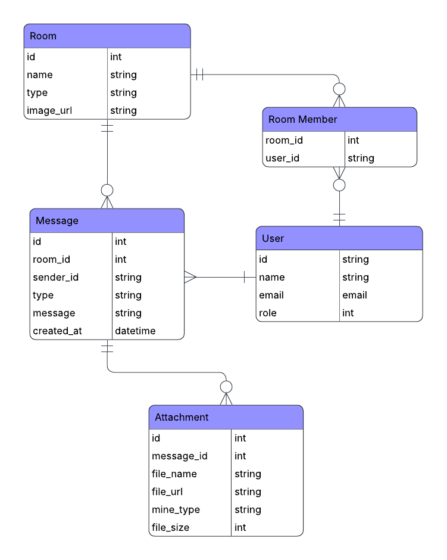
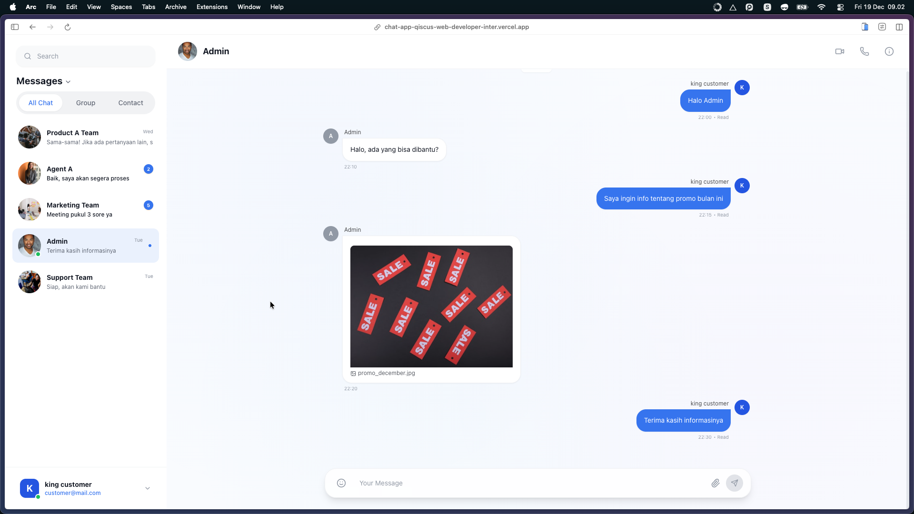
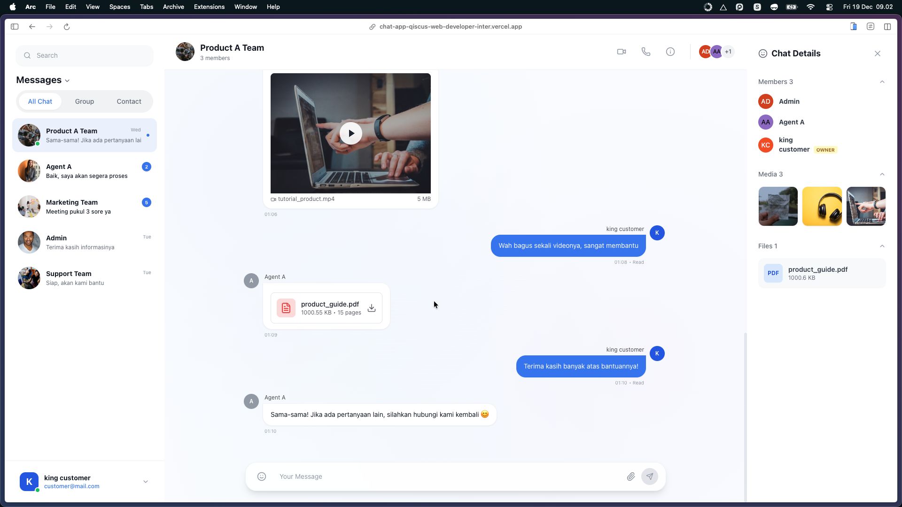

# Chat UI – Frontend Technical Assessment

  

## Overview

This project is a **frontend chat application** developed as part of a **Frontend Developer Intern technical assessment**.  
The application demonstrates how a chat system can support **private and group conversations** and render **multiple message types** using a predefined **dummy JSON response**.

The focus of this project is on **UI rendering, component structure, and data handling**, without implementing backend or realtime services.

---

## Objectives

- Build a responsive chat interface for web
- Render chat conversations using a provided JSON structure
- Support multiple message types:
  - Text
  - Image
  - Video
  - PDF/File
- Demonstrate understanding of chat system architecture and database modeling

---

## Tech Stack

- **React** (Vite)
- **Tailwind CSS**
- **JavaScript**
- **Local Dummy JSON**

No backend API, authentication, or realtime WebSocket implementation is included.

---

## Features

### Chat Interface
- Three-column layout:
  - Chat list
  - Conversation area
  - Group information panel
- Chat header displaying room name and participant count
- Message bubbles with left/right alignment based on sender
- Fixed message input (text only)

### Supported Message Types
- **Text messages**
- **Image messages** (thumbnail preview)
- **Video messages** (HTML5 video player)
- **PDF/File messages** (file card with filename and size)

### Group Information Panel
- Member list with roles
- Shared images preview
- Shared files list

---

## System Design

### Chat System Diagram
#### System Diagam


The chat system is conceptually designed with the following components:
- Web Client (React)
- Chat API Server (REST)
- Realtime Service (WebSocket)
- Authentication Service
- Media Storage
- Database

This diagram represents **conceptual system architecture only**.  
No backend services are implemented in this project.

---

### Database Design (ERD)
#### Entity Relationship Diagram


The database structure supports both **private** and **group** chats using a unified model:
- **Room**
- **User**
- **Room Member**
- **Message**
- **Attachment**

A private chat is represented as a room with **two members**, while a group chat contains **more than two members**.

---

## Project Structure
```text
src/
├── components/
│ ├── ChatHeader.jsx
│ ├── MessageList.jsx
│ ├── MessageBubble.jsx
│ ├── MediaMessage.jsx
│ ├── FileMessage.jsx
│ └── MessageInput.jsx
├── data/
│ └── chat-data.json
├── pages/
│ └── ChatPage.jsx
├── App.jsx
└── main.jsx
```

---

## Dummy Data

The application uses a local JSON file to represent:
- Chat rooms (private and group)
- Participants
- Messages
- Media attachments

The data structure is aligned with the ERD and designed to be extensible for additional message types.

---

## Scope & Limitations

The following features are **intentionally out of scope** for this assessment:

- File upload (image/video/PDF)
- Realtime messaging (WebSocket)
- Authentication and authorization
- Message persistence
- Read receipts and typing indicators

These features are excluded to keep the focus on **frontend UI rendering and data-driven components**, as required by the assessment.

---

## How to Run

1. Clone the repository:
   ```bash
   git clone https://github.com/yourusername/chat_app_qiscus_web_developer_intern.git
   cd chat_app_qiscus_web_developer_intern
   ```

2. Install dependencies:
   ```bash
   npm install
   ```

3. Run the development server:
   ```bash
   npm start
   ```

4. Open your browser and navigate to:
   ```
   http://localhost:5173
   ```

---

## Screenshots

#### Private Chat


#### Group Chat


---

### Live Demo
Check out the live project here: [Chat App](https://chat-app-qiscus-web-developer-inter.vercel.app/)

---

## Summary

This project demonstrates:

Frontend UI development using React and Tailwind CSS

Structured rendering of chat conversations from JSON data

Support for multiple message types

Clear separation of concerns through reusable components

Awareness of technical scope and assessment requirements

---

## Author

Rifqi
Frontend Developer Intern Candidate
